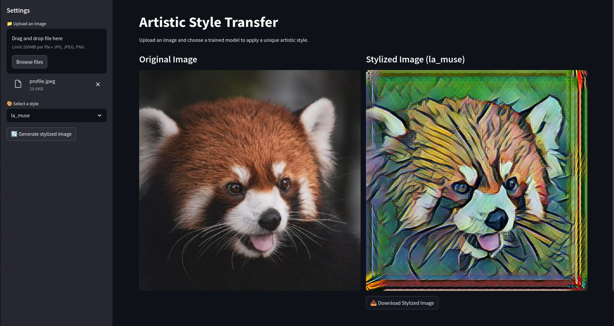

# 🎨 Stylium - Artistic Style Transfer

**Stylium** is a real-time image style transfer application powered by deep learning. It allows you to apply famous artistic styles to any image using a simple web interface built with Streamlit.

## 🚀 Overview



## 🧠 How It Works

Workflow:

1. Upload an input image.
2. Select a pretrained style model (`.ckpt`).
3. The neural network applies the style to the image.
4. View and download the stylized output.

## 📦 Installation

```bash
git clone https://github.com/dwesh163/Stylium.git
cd Stylium
pip install -r requirements.txt
```

> ⚠️ The app requires **TensorFlow 1.x** (e.g., `tensorflow==1.15`) since it uses the `tf.compat.v1` API.

## 🖼️ Usage

### Launch the Streamlit app

```bash
streamlit run app.py
```

### UI Features

-   📁 Upload a `.jpg`, `.jpeg`, or `.png` image
-   🎨 Select a pretrained style model
-   🔄 Click “Generate stylized image”
-   📥 Download the result

### 📁 Directory Structure

Make sure your pretrained models are in a `models/` directory at the root of the project:

```
Stylium/
├── app.py
├── models/
│   ├── candy.ckpt
│   └── mosaic.ckpt
```

You can train your own models using a dataset such as [WikiArt](https://www.wikiart.org/) or use pretrained ones.
